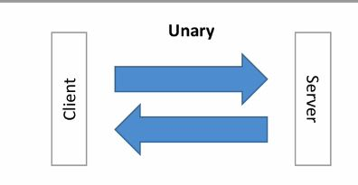
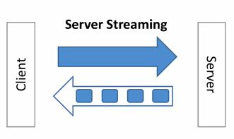
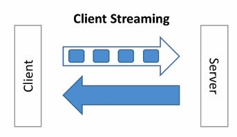
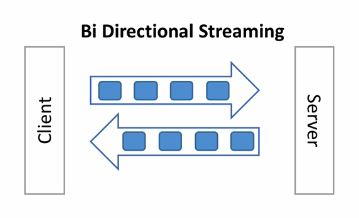

# Why?

Not CPU intensive

Payload size is half as json size, because the data is represented in a way that it is as close to machine way to handle it. It is not human readable

Example:

```

```

# HTTP/1.1

Not HTTP /1.1
>released in 1997, a long time ago
>opens a new TCP connection to a server at each request
>it does not compress header (which are plaint text)
>it only works with Request / Response mechanism (no server push)
>http was originally composed of two commands

* GET: to ask the content
* POST: to send the content

# HTTP/2

GRPC leverages http/2

* Released in 2015 (SPDY)
* Supports multiplexing

>The client & server can push messages in parallel over the same TCP connection
>This greatly reduces the latency

* Support server push

>Servers can push streams (multiple messages) for one request from the client
>This will reduce the round trips and latency

* Support header compression

> Headers (text based) can now be compressed
> This has much impact on the packet size
> Remember each request has over 20 headers, due to cookies, caches and application headers

* It is a binary

> HTTP/1 is a text that is easy to debug, but not efficient over the network
> Protocol buffer is a binary protocol and makes great match for HTTP/2

* HTTP/2 is secure (SSL is not required but it is recommended by default)

## HTTP/2 Bottom Line

* Less chatter
* More efficient protocol
* Reduced latency
* Increased Security

> And you get all these improvement out of the box by using the GRPC framework

## GRPC Type API

### Uniry



>It is the traditional request/response model.
One client request with one response from the server

### Server Streaming


>Client makes one request. Assuming the size of response is big, within one TCP connection servers will send the response in chunks.

### Client Streaming


>Client makes one request. Assuming the size of request is big, within one TCP connection client will send the request in chunks.
Server will respond once the request completed.

### Bi Directional Streaming


>Client makes one request. Assuming the size of request is big, within one TCP connection client will send the request in chunks. Server respond in chunck as well.

## How does it look in the code

```go
service GreetService{
    //Unary
    rpc Greet (GreetRequest) returns (GreetResponse){};
    //Server streaming
    rpc GreetManyTimes (GreetManyTimesRequest) returns (stream GreetManyTimesResponse);
    //Client Streaming
    rpc LongGreet (stream LongGreetRequest) returns (LongGreetResponse);
    //Bi Directional Streaming
    rpc GreetEveryone (GreetEveryoneRequest) returns (GreetEveryoneResponse);
}

```

# REST vs GRPC


| GRPC         | REST            |
| ------------ |:--------------------:|
| Protocol Buffer - Smaller, faster           | JSON - text based, slower, bigger   |
| HTTP/2 (lower latency) - from 2015 | HTTP/ 1.1 (higher latency) - from 1997 |
| Bi-Directional & Async | Client => Server request only |
| Stream Support | Request/Response support only |
| API Oriented - "What" (no constraints - free design) | CRUD oriented (Create-Retrieve-Update-Delete/ POST GET PUT DELETE) |
| Code Generation through Protocol Buffers in any language - 1st class citizen | Code generation through OpenAPI /Swagger (add-on) - 2nd class citizen |
| RPC Based - gRPC does the plumbing for us | HTTP verbs based - we have to write the plumbing or use a 3rd party library |

### Performance


# Deadline

In http/2, an API contract can have a timeout specification.
The objective is to not let the request hold up for quite long time, especially for an expensive operation. The good news, this feature is implemented in very clean way. Both client and server need to follow a certain rule in order the request/response respect the deadline.
> Basically, the client sets the deadline for how long it will wait for a reply from the server. How it is done in go is,
```go

clientDeadline := time.Now().Add(time.Duration(*deadlineMs) * time.Millisecond)
ctx, cancel := context.WithDeadline(ctx, clientDeadline)
```
>A server needs to query if a certain request is no longer wanted, before it starts preparing the response. This makes sense especially when a request is involving the expensive operation
How it is done in go is like
```go
if ctx.Err() == context.Canceled {
	return status.New(codes.Canceled, "Client cancelled, abandoning.")
}
```


# SSL


## Generate certificate autorithy key and trust

### ca.key

```yaml
openssl genrsa --passout pass:1111 -des3 -out ca.key 4096
```

### ca.crt

```yaml
openssl req --passin pass:1111 -new -x509 -days 365 -key ca.key -out ca.crt -subj "/CN=localhost"
```

## Generate Server Private Key

### server.key

```yaml
openssl genrsa --passout pass:1111 -des3 -out server.key 4096
```

## Get Certificate Signing Request from CA

### server.csr

```yaml
openssl req -passin pass:1111 -new -key server.key -out server.csr -subj "/CN=localhost"
```

## Self sign the certificate with CA we created

### server.crt

```yaml
openssl x509 -req -passin pass:1111 -days 365 -in server.csr -CA ca.crt -CAkey ca.key -set_serial 01 -out server.crt
```

## Convert the server certificate to pem file

### server.pem

```yaml
openssl pkcs8 -topk8 -nocrypt -passin pass:1111 -in server.key -out server.pem
```

## Apply SSL on the codes

# CRUD: gRPC - Cassandra

>To create the keyspace for cassandra

```yaml

CREATE KEYSPACE IF NOT EXISTS samdb WITH REPLICATION ={'class': 'SimpleStrategy', 'replication_factor': 1};

```

>Create the table

```yaml
CREATE TABLE IF NOT exists blog_item (
    id timeuuid,
    author_id ascii,
    title text,
    content text,
    PRIMARY KEY (id,author_id)
) WITH CLUSTERING ORDER BY (author_id DESC)
AND comment = 'This table stores all blogs';

```