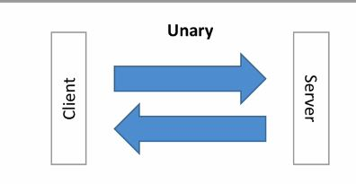
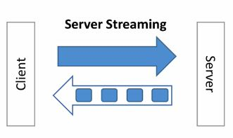
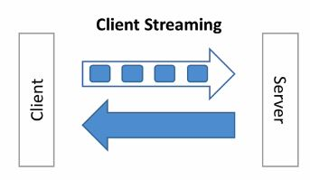
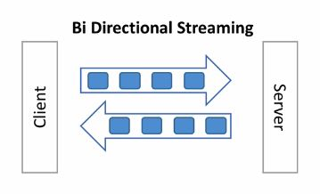
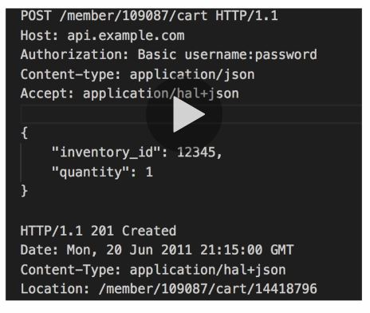

# Why?

Not CPU intensive

Payload size is half as json size, because the data is represented in a way that it is as close to machine way to handle it. It is not human readable

Example:

```

```

# HTTP/1.1

Not HTTP /1.1
>released in 1997, a long time ago
>opens a new TCP connection to a server at each request
>it does not compress header (which are plaint text)
>it only works with Request / Response mechanism (no server push)
>http was originally composed of two commands

* GET: to ask the content
* POST: to send the content

# HTTT/2

GRPC leverages http/2

* Released in 2015 (SPDY)
* Supports multiplexing

>The client & server can push messages in parallel over the same TCP connection
>This greatly reduces the latency

* Support server push

>Servers can push streams (multiple messages) for one request from the client
>This will reduce the round trips and latency

* Support header compression

> Headers (text based) can now be compressed
> This has much impact on the packet size
> Remember each request has over 20 headers, due to cookies, caches and application headers

* It is a binary

> HTTP/1 is a text that is easy to debug, but not efficient over the network
> Protocol buffer is a binary protocol and makes great match for HTTP/2

* HTTP/2 is secure (SSL is not required but it is recommended by default)

## HTTP/2 Bottom Line

* Less chatter
* More efficient protocol
* Reduced latency
* Increased Security

> And you get all these improvement out of the box by using the GRPC framework

## GRPC Type API

### Uniry



>It is the traditional request/response model.
One client request with one response from the server

### Server Streaming


>Client makes one request. Assuming the size of response is big, within one TCP connection servers will send the response in chunks.

### Client Streaming


>Client makes one request. Assuming the size of request is big, within one TCP connection client will send the request in chunks.
Server will respond once the request completed.

### Bi Directional Streaming


>Client makes one request. Assuming the size of request is big, within one TCP connection client will send the request in chunks. Server repond in chunck as well.

## How does it look in the code

```go
service GreetService{
    //Unary
    rpc Greet (GreetRequest) returns (GreetResponse){};
    //Server streaming
    rpc GreetManyTimes (GreetManyTimesRequest) returns (stream GreetManyTimesResponse);
    //Client Streaming
    rpc LongGreet (stream LongGreetRequest) returns (LongGreetResponse);
    //Bi Directional Streaming
    rpc GreetEveryone (GreetEveryoneRequest) returns (GreetEveryoneResponse);
}

```

# REST vs GRPC



| GRPC         | REST            |
| ------------ |:--------------------:|
| Protocol Buffer - Smaller, faster           | JSON - text based, slower, bigger   |
| HTTP/2 (lower latency) - from 2015 | HTTP/ 1.1 (higher latency) - from 1997 |
| Bi-Directional & Async | Client => Server request only |
| Stream Support | Request/Response support only |
| API Oriented - "What" (no constraints - free design) | CRUD oriented (Create-Retrieve-Update-Delete/ POST GET PUT DELETE) |
| Code Generation through Protocol Buffers in any language - 1st class citizen | Code generation through OpenAPI /Swagger (add-on) - 2nd class citizen |
| RPC Based - gRPC does the plumbing for us | HTTP verbs based - we have to write the plumbing or use a 3rd party library |

### Performance


# Codes

## Unary
